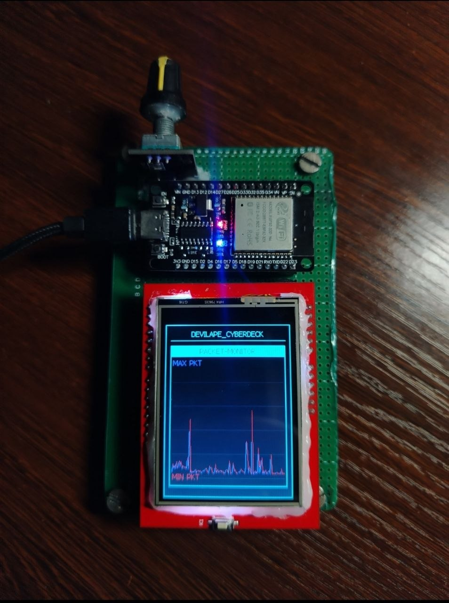

# DEVILAPE_CYBERDECK

ESP32-powered cyberdeck interface featuring a tactical TFT UI, rotary encoder navigation, WiFi/BLE monitoring tools, packet visualization, radar scanning, animated telemetry, and embedded cyberpunk-inspired diagnostics.



---

## Overview

DEVILAPE_CYBERDECK is a standalone ESP32 cyberdeck project built around a 240x320 ST7789 TFT display and rotary encoder control system.

The project combines:

* Real-time WiFi analysis
* BLE device scanning
* Packet monitoring
* Deauthentication detection
* Beacon frame simulation
* Radar-style signal visualization
* Animated telemetry dashboards
* System logging

The interface is fully menu-driven and optimized for embedded hardware aesthetics.

---

## Features

### Spectrum Analyzer
Visualizes nearby WiFi activity across channels using animated bar graphs.

### Packet Monitor
Captures WiFi management packets in promiscuous mode with live traffic visualization.

### Cyber Core Telemetry
Displays simulated network diagnostics and cyberdeck telemetry.

### Radar Scan
Animated radar-style signal scanner using RSSI values.

### BLE Capture
Scans and displays nearby BLE devices and addresses.

### Net Runner
WiFi network browser with RSSI and channel information.

### Deauth Sniffer
Detects deauthentication/disassociation packets with threat alerts.

### Beacon Flood Simulator
Broadcasts rotating custom SSIDs using raw beacon frames.

### System Logs
Embedded rolling event logger for system activity and alerts.

---

## Hardware Used

### Core Components

* ESP32 Dev Module
* ST7789 240x320 TFT Display
* Rotary Encoder
* Passive Buzzer

---

## TFT Display Configuration

This project uses a 240x320 ST7789 TFT display in 8-bit parallel mode with the `TFT_eSPI` library.

Unlike standard SPI TFT setups, this build uses the ESP32 parallel TFT interface for faster rendering and smoother UI updates.

### Why Parallel Mode?

The cyberdeck UI performs:

* Real-time graph rendering
* Radar sweep animation
* Packet visualization
* Dynamic telemetry updates
* Full-screen redraws

Using 8-bit parallel mode significantly improves display speed compared to SPI TFT interfaces.

### TFT Parallel Wiring

| TFT Pin | ESP32 GPIO |
| :--- | :--- |
| **D0** | GPIO 12 |
| **D1** | GPIO 13 |
| **D2** | GPIO 26 |
| **D3** | GPIO 25 |
| **D4** | GPIO 17 |
| **D5** | GPIO 16 |
| **D6** | GPIO 27 |
| **D7** | GPIO 14 |
| **CS** | GPIO 33 |
| **DC / RS** | GPIO 15 |
| **WR** | GPIO 4 |
| **RD** | GPIO 2 |
| **RST** | GPIO 32 |
| **VCC** | 3.3V |
| **GND** | GND |

### TFT_eSPI Setup
The TFT requires custom `TFT_eSPI` configuration. See [`TFT_SETUP.md`](TFT_SETUP.md) for the complete `User_Setup.h` configuration.

---

## Auxiliary Wiring

### Rotary Encoder Wiring

| Encoder Pin | ESP32 GPIO |
| :--- | :--- |
| **CLK** | GPIO 34 |
| **DT** | GPIO 35 |
| **SW** | GPIO 21 |
| **+** | 3.3V |
| **GND** | GND |

### Buzzer Wiring

| Buzzer Pin | ESP32 GPIO |
| :--- | :--- |
| **+** | GPIO 22 |
| **-** | GND |

---

## Libraries Used

Required libraries:

* `TFT_eSPI`
* `AiEsp32RotaryEncoder`
* `ESP32 WiFi`
* `ESP32 BLE Arduino`

```cpp
#include <TFT_eSPI.h>
#include <WiFi.h>
#include "AiEsp32RotaryEncoder.h"
#include "esp_wifi.h"
#include <BLEDevice.h>
#include <BLEUtils.h>
#include <BLEScan.h>
#include <BLEAdvertisedDevice.h>
